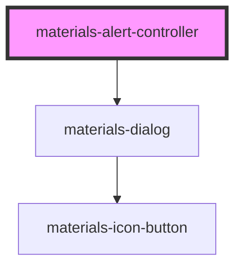

# materials-alert-controller

<!-- Auto Generated Below -->

## Methods

### `create(opts: AlertOpts) => Promise<HTMLMaterialsDialogElement>`

Create a HTMLMaterialsDialogElement and returns it

#### Returns

Type: `Promise<HTMLMaterialsDialogElement>`

## Dependencies

### Depends on

- [materials-dialog](..\dialog)

### Graph

----------------------------------------------

*Built with [StencilJS](https://stenciljs.com/)*
