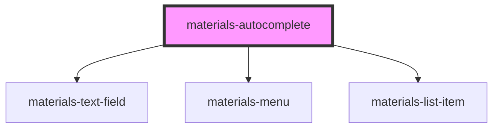

# materials-autocomplete

<!-- Auto Generated Below -->

## Properties

| Property       | Attribute | Description                                                                                                                                                  | Type                                               | Default     |
| -------------- | --------- | ------------------------------------------------------------------------------------------------------------------------------------------------------------ | -------------------------------------------------- | ----------- |
| `autocomplete` | --        | Function of autocompletion to pass to the element called during onInput of the text-field                                                                    | `(search: string) => Promise<Map<string, string>>` | `undefined` |
| `dense`        | `dense`   | For the density of the element                                                                                                                               | `boolean`                                          | `false`     |
| `value`        | --        | Value of the autocomplete text-field composed by a label to be displayed in the text-field and a value that is a real value if no label given, label = value | `{ label?: string; value: string; }`               | `undefined` |

## Events

| Event    | Description                                 | Type               |
| -------- | ------------------------------------------- | ------------------ |
| `change` | Change event emitted when value is selected | `CustomEvent<any>` |

## Dependencies

### Depends on

- [materials-text-field](../text-field)
- [materials-menu](../menu)
- [materials-list-item](../list-item)

### Graph

----------------------------------------------

*Built with [StencilJS](https://stenciljs.com/)*
