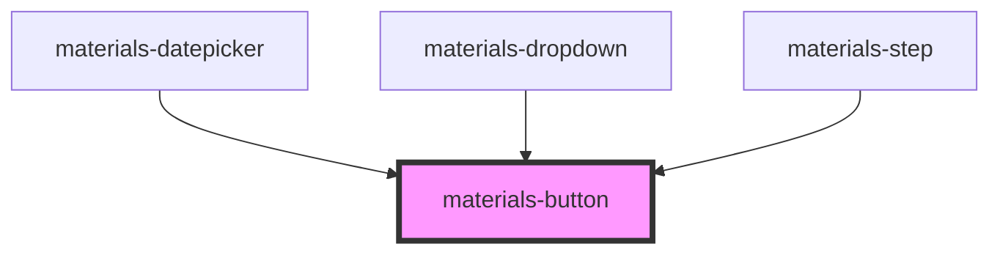

# materials-button

<!-- Auto Generated Below -->

## Properties

| Property     | Attribute    | Description                                                | Type                              | Default     |
| ------------ | ------------ | ---------------------------------------------------------- | --------------------------------- | ----------- |
| `block`      | `block`      |                                                            | `boolean`                         | `undefined` |
| `color`      | `color`      |                                                            | `string`                          | `'primary'` |
| `dense`      | `dense`      |                                                            | `boolean`                         | `undefined` |
| `disabled`   | `disabled`   |                                                            | `boolean`                         | `false`     |
| `icon`       | `icon`       |                                                            | `string`                          | `undefined` |
| `outlined`   | `outlined`   |                                                            | `boolean`                         | `undefined` |
| `radius`     | `radius`     | Attention la valeur du border-radius sera toujours en px ! | `number \| string`                | `undefined` |
| `raised`     | `raised`     |                                                            | `boolean`                         | `undefined` |
| `type`       | `type`       |                                                            | `"button" \| "reset" \| "submit"` | `undefined` |
| `unelevated` | `unelevated` |                                                            | `boolean`                         | `undefined` |

## Dependencies

### Used by

 - [materials-datepicker](..\datepicker)
 - [materials-dropdown](..\dropdown)
 - [materials-step](..\stepper)

### Graph

----------------------------------------------

*Built with [StencilJS](https://stenciljs.com/)*
