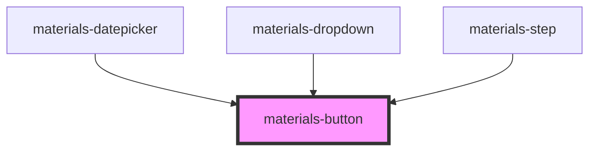

# materials-button

A Material Design button component.

To render a clear Material button on any html page :
  ```<materials-button>Click me</materials-button>```

You can use any icon from the material-icons collection (https://material.io/tools/icons)

Code is available on github: https://github.com/GMV-centravet/materials/tree/master/src/components/button

Material Design guidelines: https://material.io/design/components/buttons.html

<!-- Auto Generated Below -->


## Properties

| Property     | Attribute    | Description                                                                                                                                                         | Type                              | Default     |
| ------------ | ------------ | ------------------------------------------------------------------------------------------------------------------------------------------------------------------- | --------------------------------- | ----------- |
| `block`      | `block`      | Render a block Material button (Full width)                                                                                                                         | `boolean`                         | `false`     |
| `color`      | `color`      | The button color, it can be either : - a predifined value : 'primary', 'secondary', 'error'. - an hexa color code : #225566, #CCC. - a css named color : red, blue. | `string`                          | `'primary'` |
| `dense`      | `dense`      | Render a dense Material button ()                                                                                                                                   | `boolean`                         | `false`     |
| `disabled`   | `disabled`   | Disable the button                                                                                                                                                  | `boolean`                         | `false`     |
| `icon`       | `icon`       | A material icon name                                                                                                                                                | `string`                          | `''`        |
| `outlined`   | `outlined`   | Render an outlined Material button                                                                                                                                  | `boolean`                         | `false`     |
| `raised`     | `raised`     | Render a raised Material button                                                                                                                                     | `boolean`                         | `false`     |
| `type`       | `type`       | The button type                                                                                                                                                     | `"button" \| "reset" \| "submit"` | `'button'`  |
| `unelevated` | `unelevated` | Render an unelevated Material button                                                                                                                                | `boolean`                         | `false`     |


## Dependencies

### Used by

 - [materials-datepicker](../datepicker)
 - [materials-dropdown](../dropdown)
 - [materials-step](../stepper)

### Graph


----------------------------------------------

*Built with [StencilJS](https://stenciljs.com/)*
