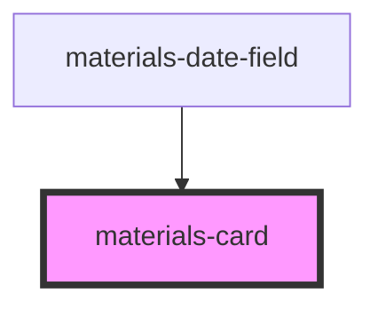

# materials-card

<!-- Auto Generated Below -->

## Properties

| Property    | Attribute    | Description                          | Type       | Default     |
| ----------- | ------------ | ------------------------------------ | ---------- | ----------- |
| `cardTitle` | `card-title` | Set Card title                       | `string`   | `undefined` |
| `elevation` | `elevation`  | Set Card shadow elevation            | `number`   | `1`         |
| `height`    | `height`     | Set Card height                      | `string`   | `'auto'`    |
| `maxHeight` | `max-height` | Set Card max height                  | `string`   | `undefined` |
| `onAction`  | --           | Function executed when click on card | `Function` | `undefined` |
| `padding`   | `padding`    | Set Card padding                     | `number`   | `undefined` |
| `width`     | `width`      | Set Card width                       | `string`   | `'auto'`    |

## Dependencies

### Used by

 - [materials-date-field](../date-field)

### Graph

----------------------------------------------

*Built with [StencilJS](https://stenciljs.com/)*
