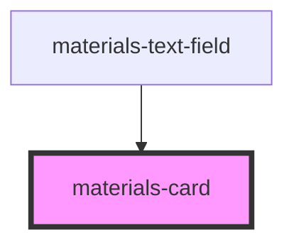

# materials-card

<!-- Auto Generated Below -->

## Properties

| Property    | Attribute    | Description | Type     | Default     |
| ----------- | ------------ | ----------- | -------- | ----------- |
| `elevation` | `elevation`  |             | `number` | `1`         |
| `height`    | `height`     |             | `string` | `'auto'`    |
| `maxHeight` | `max-height` |             | `string` | `undefined` |
| `padding`   | `padding`    |             | `number` | `undefined` |
| `width`     | `width`      |             | `string` | `'auto'`    |

## Dependencies

### Used by

 - [materials-text-field](..\text-field)

### Graph

----------------------------------------------

*Built with [StencilJS](https://stenciljs.com/)*
