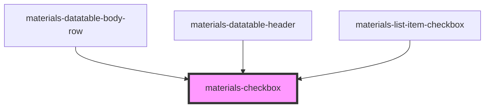

# materials-checkbox

<!-- Auto Generated Below -->

## Properties

| Property        | Attribute       | Description | Type               | Default     |
| --------------- | --------------- | ----------- | ------------------ | ----------- |
| `alignLabel`    | `align-label`   |             | `string`           | `'left'`    |
| `checked`       | `checked`       |             | `boolean`          | `false`     |
| `color`         | `color`         |             | `string`           | `'accent'`  |
| `disabled`      | `disabled`      |             | `boolean`          | `false`     |
| `indeterminate` | `indeterminate` |             | `boolean`          | `false`     |
| `label`         | `label`         |             | `string`           | `undefined` |
| `name`          | `name`          |             | `string`           | `undefined` |
| `value`         | `value`         |             | `number \| string` | `undefined` |

## Events

| Event    | Description | Type               |
| -------- | ----------- | ------------------ |
| `change` |             | `CustomEvent<any>` |

## Dependencies

### Used by

 - [materials-datatable-body-row](../datatable/datatable-body-row)
 - [materials-datatable-header](../datatable/datatable-header)
 - [materials-list-item-checkbox](../list-item-checkbox)

### Graph

----------------------------------------------

*Built with [StencilJS](https://stenciljs.com/)*
