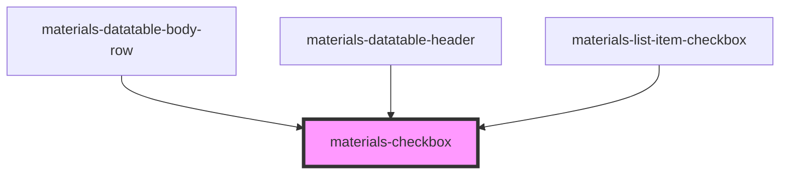

# materials-checkbox

<!-- Auto Generated Below -->

## Properties

| Property        | Attribute       | Description                                          | Type                | Default     |
| --------------- | --------------- | ---------------------------------------------------- | ------------------- | ----------- |
| `alignLabel`    | `align-label`   | If a label is provided, where should it be aligned ? | `"left" \| "right"` | `'left'`    |
| `checked`       | `checked`       | Mark the checkbox as checked                         | `boolean`           | `false`     |
| `color`         | `color`         | Color of the checkbox                                | `string`            | `'accent'`  |
| `disabled`      | `disabled`      | Mark the checkbox as disabled                        | `boolean`           | `false`     |
| `indeterminate` | `indeterminate` | Make the checkbox appear indeterminate               | `boolean`           | `false`     |
| `label`         | `label`         | The checkbox label (Optionnal)                       | `string`            | `undefined` |
| `name`          | `name`          | Checkbox name                                        | `string`            | `undefined` |
| `value`         | `value`         | The checkbox value                                   | `number \| string`  | `undefined` |

## Events

| Event    | Description                                      | Type               |
| -------- | ------------------------------------------------ | ------------------ |
| `change` | Change event emitted when checkbox value changes | `CustomEvent<any>` |

## Dependencies

### Used by

 - [materials-datatable-body-row](../datatable/datatable-body-row)
 - [materials-datatable-header](../datatable/datatable-header)
 - [materials-list-item-checkbox](../list-item-checkbox)

### Graph

----------------------------------------------

*Built with [StencilJS](https://stenciljs.com/)*
