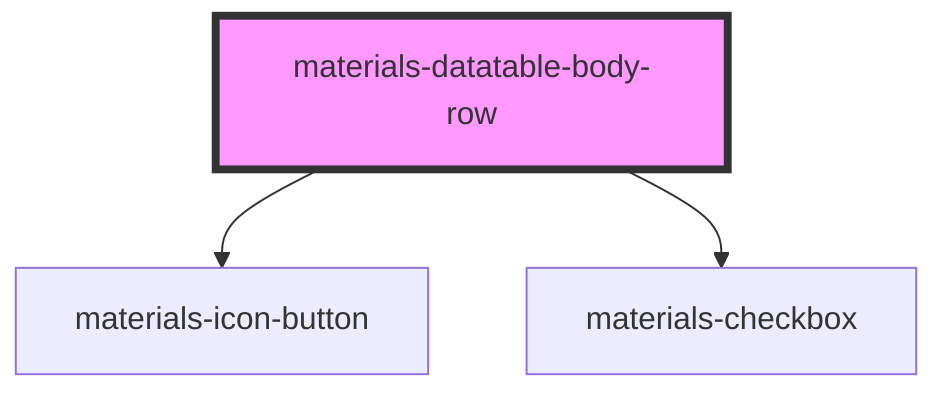

# materials-datatable-body-row

<!-- Auto Generated Below -->

## Properties

| Property     | Attribute    | Description | Type      | Default     |
| ------------ | ------------ | ----------- | --------- | ----------- |
| `dense`      | `dense`      |             | `boolean` | `undefined` |
| `expendable` | `expendable` |             | `boolean` | `undefined` |
| `expended`   | `expended`   |             | `boolean` | `undefined` |
| `selectable` | `selectable` |             | `boolean` | `undefined` |
| `selected`   | `selected`   |             | `boolean` | `false`     |

## Events

| Event       | Description | Type                   |
| ----------- | ----------- | ---------------------- |
| `selectRow` |             | `CustomEvent<boolean>` |

## Dependencies

### Depends on

- [materials-icon-button](..\..\icon-button)
- [materials-checkbox](..\..\checkbox)

### Graph

----------------------------------------------

*Built with [StencilJS](https://stenciljs.com/)*
