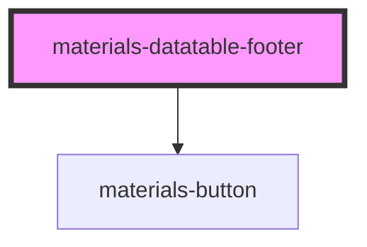

# materials-datatable-footer

<!-- Auto Generated Below -->

## Properties

| Property | Attribute | Description | Type                       | Default     |
| -------- | --------- | ----------- | -------------------------- | ----------- |
| `color`  | `color`   |             | `"primary" \| "secondary"` | `undefined` |

## Dependencies

### Depends on

- [materials-button](../../button)

### Graph

----------------------------------------------

*Built with [StencilJS](https://stenciljs.com/)*
