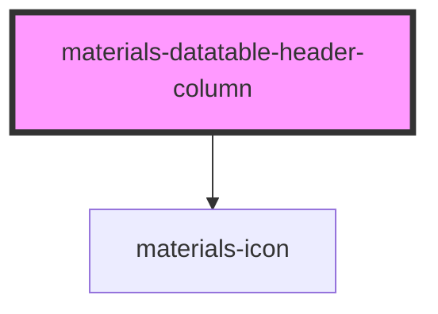

# materials-datatable-header-column

<!-- Auto Generated Below -->

## Properties

| Property      | Attribute     | Description | Type                           | Default     |
| ------------- | ------------- | ----------- | ------------------------------ | ----------- |
| `align`       | `align`       |             | `"center" \| "end" \| "start"` | `'start'`   |
| `description` | `description` |             | `string`                       | `undefined` |
| `label`       | `label`       |             | `string`                       | `undefined` |
| `sortable`    | `sortable`    |             | `boolean`                      | `undefined` |
| `sorted`      | `sorted`      |             | `boolean`                      | `undefined` |
| `value`       | `value`       |             | `string`                       | `undefined` |
| `width`       | `width`       |             | `string`                       | `undefined` |

## Events

| Event  | Description | Type                |
| ------ | ----------- | ------------------- |
| `sort` |             | `CustomEvent<Sort>` |

## Dependencies

### Depends on

- [materials-icon](../../icon)

### Graph

----------------------------------------------

*Built with [StencilJS](https://stenciljs.com/)*
