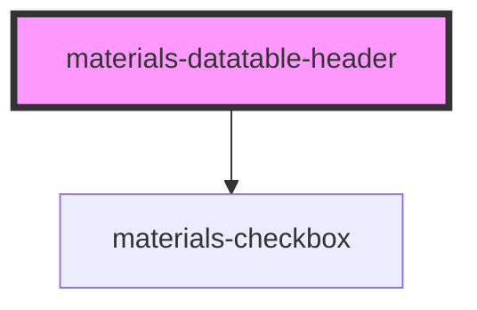

# materials-datatable-header

<!-- Auto Generated Below -->

## Properties

| Property     | Attribute    | Description | Type                       | Default     |
| ------------ | ------------ | ----------- | -------------------------- | ----------- |
| `color`      | `color`      |             | `"primary" \| "secondary"` | `undefined` |
| `selectable` | `selectable` |             | `boolean`                  | `undefined` |
| `selected`   | `selected`   |             | `boolean`                  | `undefined` |

## Events

| Event       | Description | Type                   |
| ----------- | ----------- | ---------------------- |
| `selectAll` |             | `CustomEvent<boolean>` |

## Dependencies

### Depends on

- [materials-checkbox](../../checkbox)

### Graph

----------------------------------------------

*Built with [StencilJS](https://stenciljs.com/)*
