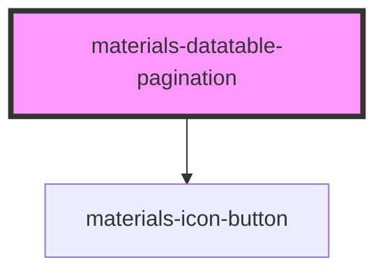

# materials-datatable-pagination

<!-- Auto Generated Below -->

## Properties

| Property      | Attribute      | Description | Type     | Default |
| ------------- | -------------- | ----------- | -------- | ------- |
| `currentPage` | `current-page` |             | `number` | `0`     |
| `first`       | `first`        |             | `number` | `0`     |
| `last`        | `last`         |             | `number` | `0`     |
| `size`        | `size`         |             | `number` | `0`     |
| `total`       | `total`        |             | `number` | `0`     |

## Events

| Event          | Description | Type               |
| -------------- | ----------- | ------------------ |
| `nextPage`     |             | `CustomEvent<any>` |
| `previousPage` |             | `CustomEvent<any>` |

## Dependencies

### Depends on

- [materials-icon-button](..\..\icon-button)

### Graph

----------------------------------------------

*Built with [StencilJS](https://stenciljs.com/)*
