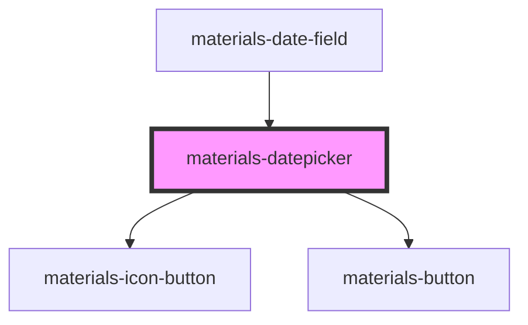

# materials-datepicker

<!-- Auto Generated Below -->

## Properties

| Property       | Attribute      | Description                                                     | Type                          | Default                                     |
| -------------- | -------------- | --------------------------------------------------------------- | ----------------------------- | ------------------------------------------- |
| `dateRange`    | --             | Used to highlight a time period such as : from Monday to Sunday | `{ start: Date; end: Date; }` | `{ start: new Date(), end: new Date() }`    |
| `dateSelected` | --             | Used to display current selected date                           | `Date`                        | `new Date(new Date().setHours(0, 0, 0, 0))` |
| `monthPicker`  | `month-picker` | Display month picker on the element                             | `boolean`                     | `true`                                      |
| `nullable`     | `nullable`     | Display button to empty value of the element                    | `boolean`                     | `false`                                     |
| `todayPicker`  | `today-picker` | Display button for selecting today's date                       | `boolean`                     | `true`                                      |
| `yearPicker`   | `year-picker`  | Display year picker on the element                              | `boolean`                     | `true`                                      |

## Events

| Event                | Description                             | Type                |
| -------------------- | --------------------------------------- | ------------------- |
| `dateSelectedUpdate` | Event emitted when new date is selected | `CustomEvent<Date>` |

## Dependencies

### Used by

 - [materials-date-field](../date-field)

### Depends on

- [materials-icon-button](../icon-button)
- [materials-button](../button)

### Graph

----------------------------------------------

*Built with [StencilJS](https://stenciljs.com/)*
