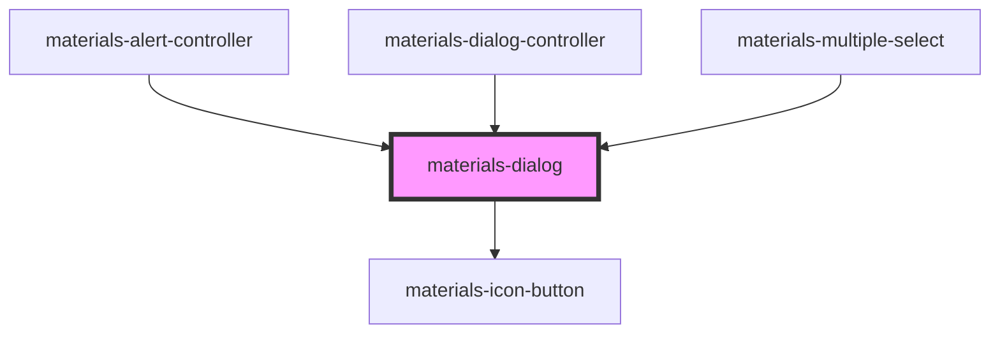

# materials-dialog

<!-- Auto Generated Below -->

## Properties

| Property              | Attribute               | Description                                                                                         | Type                    | Default     |
| --------------------- | ----------------------- | --------------------------------------------------------------------------------------------------- | ----------------------- | ----------- |
| `acceptButton`        | `accept-button`         | Display a button which execute accept action                                                        | `string`                | `undefined` |
| `actions`             | --                      | A list of this dialog actions                                                                       | `DialogAction[]`        | `undefined` |
| `body`                | `body`                  | The dialog body, it can be an HTMLElement or plain text                                             | `HTMLElement \| string` | `undefined` |
| `cancelButton`        | `cancel-button`         | Display a button which execute cancel action                                                        | `string`                | `undefined` |
| `closeButton`         | `close-button`          | Display a close button in the top right of the dialog                                               | `boolean`               | `undefined` |
| `dialogTitle`         | `dialog-title`          | Set the title of the dialog                                                                         | `string`                | `''`        |
| `disableAcceptButton` | `disable-accept-button` | Display accept button as disabled                                                                   | `boolean`               | `undefined` |
| `height`              | `height`                | Set the height of the dialog screen                                                                 | `string`                | `undefined` |
| `items`               | --                      | **[DEPRECATED]** since 1.1.0 : not used                      | `string[]`              | `[]`        |
| `scrollable`          | `scrollable`            | **[DEPRECATED]** since 1.1.0 : dialog scroll automatically   | `boolean`               | `undefined` |
| `width`               | `width`                 | Set the witdth of the dialog screen                                                                 | `string`                | `undefined` |

## Events

| Event    | Description                                | Type               |
| -------- | ------------------------------------------ | ------------------ |
| `accept` | Event emitted when acceptButton is clicked | `CustomEvent<any>` |
| `cancel` | Event emitted when cancelButton is clicked | `CustomEvent<any>` |

## Methods

### `close() => Promise<void>`

CloseS the dialog

#### Returns

Type: `Promise<void>`

### `isOpen() => Promise<boolean>`

Returns true if the dialog is open

#### Returns

Type: `Promise<boolean>`

### `open() => Promise<void>`

Opens the dialog

#### Returns

Type: `Promise<void>`

### `show() => Promise<void>`

#### Returns

Type: `Promise<void>`

### `toggle() => Promise<void>`

Open/close dialog

#### Returns

Type: `Promise<void>`

## Dependencies

### Used by

 - [materials-alert-controller](../alert-controller)
 - [materials-dialog-controller](../dialog-controller)
 - [materials-multiple-select](../multiple-select)

### Depends on

- [materials-icon-button](../icon-button)

### Graph

----------------------------------------------

*Built with [StencilJS](https://stenciljs.com/)*
