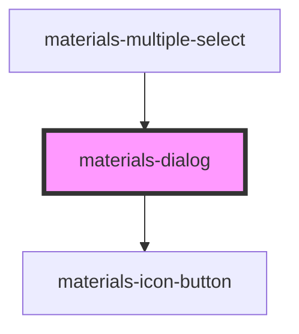

# materials-dialog

<!-- Auto Generated Below -->

## Properties

| Property              | Attribute               | Description                                                                                         | Type       | Default     |
| --------------------- | ----------------------- | --------------------------------------------------------------------------------------------------- | ---------- | ----------- |
| `acceptButton`        | `accept-button`         |                                                                                                     | `string`   | `undefined` |
| `cancelButton`        | `cancel-button`         |                                                                                                     | `string`   | `undefined` |
| `closeButton`         | `close-button`          |                                                                                                     | `boolean`  | `undefined` |
| `dialogTitle`         | `dialog-title`          |                                                                                                     | `string`   | `''`        |
| `disableAcceptButton` | `disable-accept-button` |                                                                                                     | `boolean`  | `undefined` |
| `height`              | `height`                |                                                                                                     | `string`   | `undefined` |
| `items`               | --                      |                                                                                                     | `string[]` | `[]`        |
| `scrollable`          | `scrollable`            | **[DEPRECATED]** since 1.1.0 : dialog scroll automatically   | `boolean`  | `undefined` |
| `width`               | `width`                 |                                                                                                     | `string`   | `undefined` |

## Events

| Event    | Description | Type               |
| -------- | ----------- | ------------------ |
| `accept` |             | `CustomEvent<any>` |
| `cancel` |             | `CustomEvent<any>` |

## Methods

### `close() => Promise<void>`

#### Returns

Type: `Promise<void>`

### `isOpen() => Promise<boolean>`

#### Returns

Type: `Promise<boolean>`

### `open() => Promise<void>`

#### Returns

Type: `Promise<void>`

### `show() => Promise<void>`

#### Returns

Type: `Promise<void>`

### `toggle() => Promise<void>`

#### Returns

Type: `Promise<void>`

## Dependencies

### Used by

 - [materials-multiple-select](../multiple-select)

### Depends on

- [materials-icon-button](../icon-button)

### Graph

----------------------------------------------

*Built with [StencilJS](https://stenciljs.com/)*
