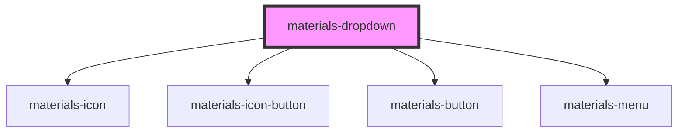

# materials-dropdown

<!-- Auto Generated Below -->

## Properties

| Property       | Attribute       | Description | Type                                                                                                                         | Default     |
| -------------- | --------------- | ----------- | ---------------------------------------------------------------------------------------------------------------------------- | ----------- |
| `buttonType`   | `button-type`   |             | `string`                                                                                                                     | `undefined` |
| `color`        | `color`         |             | `string`                                                                                                                     | `undefined` |
| `icon`         | `icon`          |             | `string`                                                                                                                     | `undefined` |
| `iconHelper`   | `icon-helper`   |             | `string`                                                                                                                     | `undefined` |
| `iconOnly`     | `icon-only`     |             | `boolean`                                                                                                                    | `undefined` |
| `menuPosition` | `menu-position` |             | `"BOTTOM_END" \| "BOTTOM_LEFT" \| "BOTTOM_RIGHT" \| "BOTTOM_START" \| "TOP_END" \| "TOP_LEFT" \| "TOP_RIGHT" \| "TOP_START"` | `undefined` |
| `menuTitle`    | `menu-title`    |             | `string`                                                                                                                     | `undefined` |

## Methods

### `closeMenu() => Promise<void>`

#### Returns

Type: `Promise<void>`

### `isOpen() => Promise<boolean>`

#### Returns

Type: `Promise<boolean>`

### `openMenu() => Promise<void>`

#### Returns

Type: `Promise<void>`

## Dependencies

### Depends on

- [materials-icon](..\icon)
- [materials-icon-button](..\icon-button)
- [materials-button](..\button)
- [materials-menu](..\menu)

### Graph

----------------------------------------------

*Built with [StencilJS](https://stenciljs.com/)*
