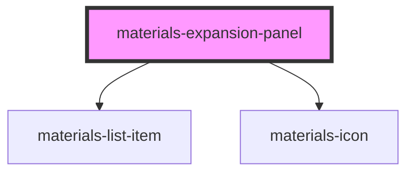

# materials-expansion-panel

<!-- Auto Generated Below -->

## Properties

| Property    | Attribute    | Description | Type                                      | Default     |
| ----------- | ------------ | ----------- | ----------------------------------------- | ----------- |
| `collapsed` | `collapsed`  |             | `boolean`                                 | `true`      |
| `elevation` | `elevation`  |             | `number`                                  | `2`         |
| `noPadding` | `no-padding` |             | `boolean`                                 | `undefined` |
| `type`      | `type`       |             | `"accordion" \| "expandable" \| "popout"` | `undefined` |

## Dependencies

### Depends on

- [materials-list-item](../list-item)
- [materials-icon](../icon)

### Graph

----------------------------------------------

*Built with [StencilJS](https://stenciljs.com/)*
