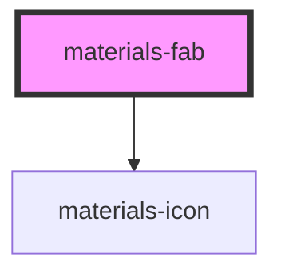

# materials-fab

<!-- Auto Generated Below -->

## Properties

| Property | Attribute | Description | Type     | Default     |
| -------- | --------- | ----------- | -------- | ----------- |
| `icon`   | `icon`    |             | `string` | `undefined` |
| `name`   | `name`    |             | `string` | `undefined` |
| `radius` | `radius`  |             | `number` | `undefined` |

## Dependencies

### Depends on

- [materials-icon](..\icon)

### Graph

----------------------------------------------

*Built with [StencilJS](https://stenciljs.com/)*
