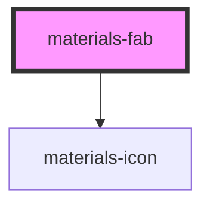

# materials-fab

<!-- Auto Generated Below -->

## Properties

| Property | Attribute | Description                                                                              | Type                  | Default     |
| -------- | --------- | ---------------------------------------------------------------------------------------- | --------------------- | ----------- |
| `hidden` | `hidden`  | Optional, animates the FAB out of view.  When set to false, the FAB will return to view. | `boolean`             | `false`     |
| `icon`   | `icon`    | Optionnal, an icon name from the material icons set                                      | `string`              | `undefined` |
| `label`  | `label`   | Optionnal, a text label  If provided, it will render as an extended FAB                  | `string`              | `undefined` |
| `size`   | `size`    | Optional, specifies the FAB size                                                         | `"medium" \| "small"` | `'medium'`  |

## Dependencies

### Depends on

- [materials-icon](../icon)

### Graph

----------------------------------------------

*Built with [StencilJS](https://stenciljs.com/)*
