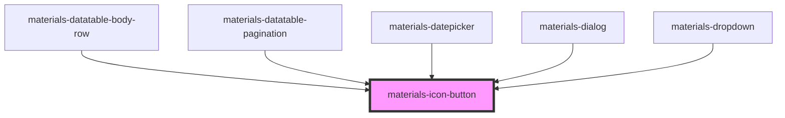

# materials-icon-button

<!-- Auto Generated Below -->

## Properties

| Property   | Attribute   | Description | Type      | Default     |
| ---------- | ----------- | ----------- | --------- | ----------- |
| `dense`    | `dense`     |             | `boolean` | `false`     |
| `disabled` | `disabled`  |             | `boolean` | `undefined` |
| `icon`     | `icon`      |             | `string`  | `undefined` |
| `iconOff`  | `icon-off`  |             | `string`  | `undefined` |
| `iconOn`   | `icon-on`   |             | `string`  | `undefined` |
| `img`      | `img`       |             | `string`  | `undefined` |
| `imgOff`   | `img-off`   |             | `string`  | `undefined` |
| `label`    | `label`     |             | `string`  | `undefined` |
| `labelOff` | `label-off` |             | `string`  | `undefined` |
| `labelOn`  | `label-on`  |             | `string`  | `undefined` |
| `large`    | `large`     |             | `boolean` | `undefined` |
| `pressed`  | `pressed`   |             | `boolean` | `undefined` |
| `svg`      | `svg`       |             | `boolean` | `undefined` |
| `svgOff`   | `svg-off`   |             | `string`  | `undefined` |

## Dependencies

### Used by

 - [materials-datatable-body-row](..\datatable\datatable-body-row)
 - [materials-datatable-pagination](..\datatable\datatable-pagination)
 - [materials-datepicker](..\datepicker)
 - [materials-dialog](..\dialog)
 - [materials-dropdown](..\dropdown)

### Graph

----------------------------------------------

*Built with [StencilJS](https://stenciljs.com/)*
