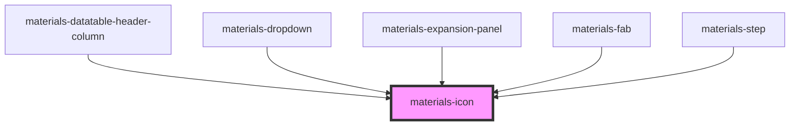

# materials-icon

<!-- Auto Generated Below -->

## Properties

| Property   | Attribute  | Description | Type      | Default     |
| ---------- | ---------- | ----------- | --------- | ----------- |
| `color`    | `color`    |             | `string`  | `undefined` |
| `dark`     | `dark`     |             | `boolean` | `undefined` |
| `disabled` | `disabled` |             | `boolean` | `undefined` |
| `light`    | `light`    |             | `boolean` | `undefined` |
| `name`     | `name`     |             | `string`  | `undefined` |
| `size`     | `size`     |             | `number`  | `undefined` |

## Dependencies

### Used by

 - [materials-datatable-header-column](../datatable/datatable-header-column)
 - [materials-dropdown](../dropdown)
 - [materials-expansion-panel](../expansion-panel)
 - [materials-fab](../fab)
 - [materials-step](../stepper)

### Graph

----------------------------------------------

*Built with [StencilJS](https://stenciljs.com/)*
