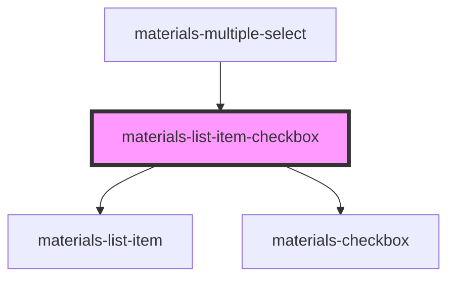

# materials-list-item-checkbox

<!-- Auto Generated Below -->

## Properties

| Property         | Attribute          | Description               | Type                  | Default     |
| ---------------- | ------------------ | ------------------------- | --------------------- | ----------- |
| `checked`        | `checked`          |                           | `boolean`             | `undefined` |
| `color`          | `color`            |                           | `string`              | `undefined` |
| `disabled`       | `disabled`         |                           | `boolean`             | `false`     |
| `itemEndStyle`   | `item-end-style`   |                           | `any`                 | `undefined` |
| `itemStartStyle` | `item-start-style` |                           | `any`                 | `undefined` |
| `label`          | `label`            |                           | `string`              | `undefined` |
| `noPadding`      | `no-padding`       |                           | `boolean`             | `undefined` |
| `size`           | `size`             |                           | `"medium" \| "small"` | `undefined` |
| `textWrap`       | `text-wrap`        | Coupe le text par defaut. | `boolean`             | `false`     |
| `value`          | `value`            |                           | `number \| string`    | `undefined` |

## Events

| Event    | Description | Type               |
| -------- | ----------- | ------------------ |
| `change` |             | `CustomEvent<any>` |

## Dependencies

### Used by

 - [materials-multiple-select](../multiple-select)

### Depends on

- [materials-list-item](../list-item)
- [materials-checkbox](../checkbox)

### Graph

----------------------------------------------

*Built with [StencilJS](https://stenciljs.com/)*
