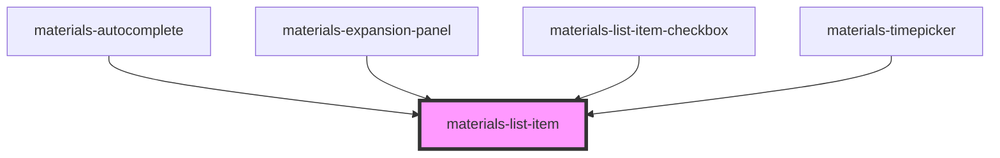

# materials-list-item

<!-- Auto Generated Below -->

## Properties

| Property         | Attribute          | Description                                               | Type                  | Default     |
| ---------------- | ------------------ | --------------------------------------------------------- | --------------------- | ----------- |
| `disabled`       | `disabled`         |                                                           | `boolean`             | `false`     |
| `divider`        | `divider`          |                                                           | `boolean`             | `false`     |
| `itemEndStyle`   | `item-end-style`   |                                                           | `any`                 | `undefined` |
| `itemStartStyle` | `item-start-style` |                                                           | `any`                 | `undefined` |
| `label`          | `label`            | Prefere le label au <slot /> pour beneficier du textWrap. | `any`                 | `undefined` |
| `noPadding`      | `no-padding`       |                                                           | `boolean`             | `undefined` |
| `role`           | `role`             |                                                           | `string`              | `undefined` |
| `selected`       | `selected`         |                                                           | `boolean`             | `undefined` |
| `size`           | `size`             | override la height par defaut du composant list-item.     | `"medium" \| "small"` | `undefined` |
| `textWrap`       | `text-wrap`        | Coupe le text par defaut.                                 | `boolean`             | `false`     |

## Dependencies

### Used by

 - [materials-autocomplete](../autocomplete)
 - [materials-expansion-panel](../expansion-panel)
 - [materials-list-item-checkbox](../list-item-checkbox)
 - [materials-timepicker](../timepicker)

### Graph

----------------------------------------------

*Built with [StencilJS](https://stenciljs.com/)*
