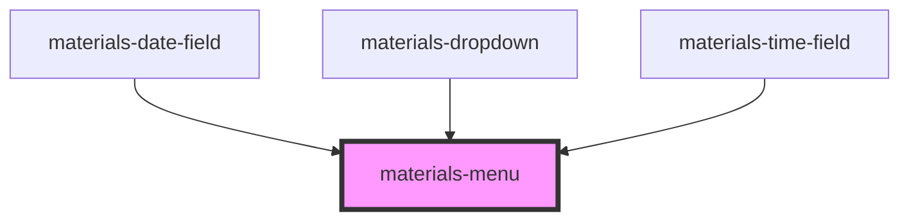

# materials-menu

<!-- Auto Generated Below -->

## Properties

| Property    | Attribute    | Description                                         | Type      | Default     |
| ----------- | ------------ | --------------------------------------------------- | --------- | ----------- |
| `maxHeight` | `max-height` | Max-height of the menu                              | `number`  | `undefined` |
| `noPadding` | `no-padding` | Override default CSS mdc-list padding-top & bottom. | `boolean` | `undefined` |

## Methods

### `close() => Promise<void>`

#### Returns

Type: `Promise<void>`

### `isOpen() => Promise<boolean>`

#### Returns

Type: `Promise<boolean>`

### `open() => Promise<void>`

#### Returns

Type: `Promise<void>`

### `setAnchorMargin(margin: AnchorMargin) => Promise<void>`

#### Returns

Type: `Promise<void>`

### `setPosition(position: "TOP_LEFT" | "TOP_RIGHT" | "BOTTOM_LEFT" | "BOTTOM_RIGHT" | "TOP_START" | "TOP_END" | "BOTTOM_START" | "BOTTOM_END") => Promise<void>`

#### Returns

Type: `Promise<void>`

## Dependencies

### Used by

 - [materials-date-field](..\date-field)
 - [materials-dropdown](..\dropdown)
 - [materials-time-field](..\time-field)

### Graph

----------------------------------------------

*Built with [StencilJS](https://stenciljs.com/)*
