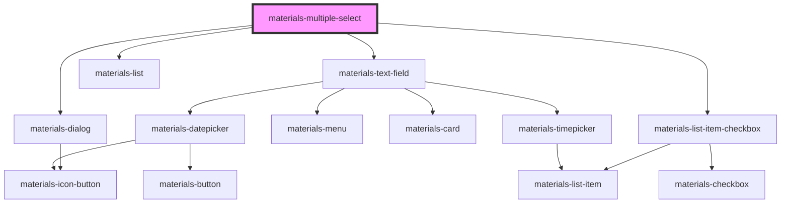

# materials-multiple-select

<!-- Auto Generated Below -->

## Properties

| Property      | Attribute      | Description | Type                  | Default     |
| ------------- | -------------- | ----------- | --------------------- | ----------- |
| `dialogTitle` | `dialog-title` |             | `string`              | `undefined` |
| `label`       | `label`        |             | `string`              | `undefined` |
| `options`     | --             |             | `Map<string, string>` | `undefined` |
| `value`       | `value`        |             | `string`              | `undefined` |

## Events

| Event    | Description | Type               |
| -------- | ----------- | ------------------ |
| `change` |             | `CustomEvent<any>` |

## Dependencies

### Depends on

- [materials-text-field](..\text-field)
- [materials-dialog](..\dialog)
- [materials-list](..\list)
- [materials-list-item-checkbox](..\list-item-checkbox)

### Graph

----------------------------------------------

*Built with [StencilJS](https://stenciljs.com/)*
