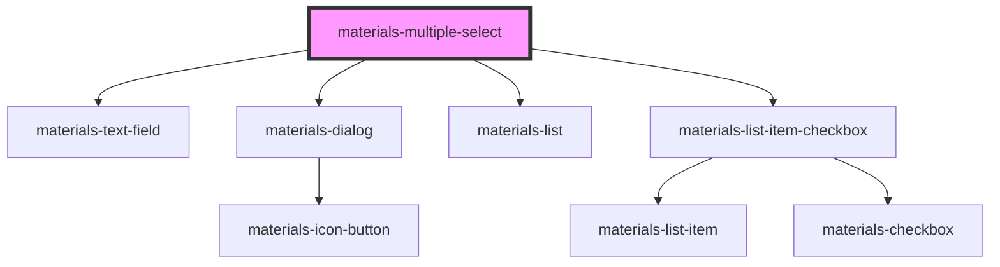

# materials-multiple-select

<!-- Auto Generated Below -->

## Properties

| Property            | Attribute             | Description                                                                                             | Type                  | Default     |
| ------------------- | --------------------- | ------------------------------------------------------------------------------------------------------- | --------------------- | ----------- |
| `dense`             | `dense`               | Apply low density on the textfield                                                                      | `boolean`             | `undefined` |
| `dialogTitle`       | `dialog-title`        | Title displayed in the dialog                                                                           | `string`              | `undefined` |
| `label`             | `label`               | Label displayed for the multi-select                                                                    | `string`              | `undefined` |
| `maxElementsColumn` | `max-elements-column` | Display selectable elements on many columns according to the max number of elements per columns allowed | `number`              | `undefined` |
| `options`           | --                    | Map of options selectable in the dialog                                                                 | `Map<string, string>` | `undefined` |
| `trailingIcon`      | `trailing-icon`       | Adds an icon at the end of the text field                                                               | `string`              | `undefined` |
| `value`             | --                    | list of selected elements                                                                               | `string[]`            | `[]`        |

## Events

| Event    | Description                                      | Type               |
| -------- | ------------------------------------------------ | ------------------ |
| `change` | Event dispatched when multi-select value changes | `CustomEvent<any>` |

## Dependencies

### Depends on

- [materials-text-field](../text-field)
- [materials-dialog](../dialog)
- [materials-list](../list)
- [materials-list-item-checkbox](../list-item-checkbox)

### Graph

----------------------------------------------

*Built with [StencilJS](https://stenciljs.com/)*
