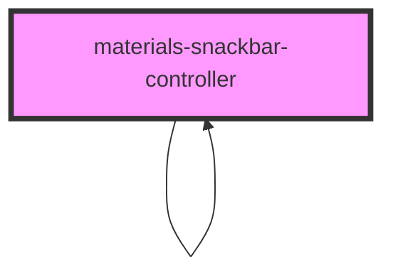

# materials-snackbar-controller

<!-- Auto Generated Below -->

## Methods

### `create(options: SnackBarOptions) => Promise<void>`

#### Returns

Type: `Promise<void>`

### `pushToQueue(snack: HTMLMaterialsSnackbarElement) => Promise<void>`

#### Returns

Type: `Promise<void>`

### `sliceQueue() => Promise<void>`

#### Returns

Type: `Promise<void>`

## Dependencies

### Used by

 - [materials-snackbar-controller]()

### Depends on

- [materials-snackbar-controller]()
- [materials-snackbar]()

### Graph

----------------------------------------------

*Built with [StencilJS](https://stenciljs.com/)*
