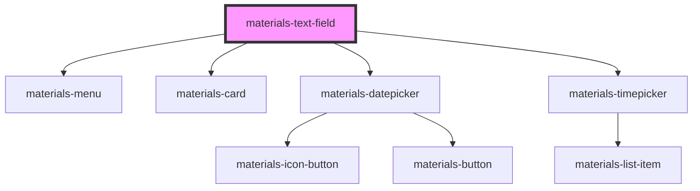

# materials-text-field

<!-- Auto Generated Below -->

## Properties

| Property                | Attribute                 | Description | Type                    | Default     |
| ----------------------- | ------------------------- | ----------- | ----------------------- | ----------- |
| `customValidation`      | --                        |             | `() => Promise<string>` | `undefined` |
| `datepicker`            | `datepicker`              |             | `boolean`               | `false`     |
| `datepickerMonthPicker` | `datepicker-month-picker` |             | `boolean`               | `true`      |
| `datepickerTodayPicker` | `datepicker-today-picker` |             | `boolean`               | `true`      |
| `datepickerYearPicker`  | `datepicker-year-picker`  |             | `boolean`               | `true`      |
| `dense`                 | `dense`                   |             | `boolean`               | `undefined` |
| `disabled`              | `disabled`                |             | `boolean`               | `undefined` |
| `focused`               | `focused`                 |             | `boolean`               | `undefined` |
| `fullwidth`             | `fullwidth`               |             | `boolean`               | `undefined` |
| `helperText`            | `helper-text`             |             | `string`                | `undefined` |
| `label`                 | `label`                   |             | `string`                | `undefined` |
| `leadingIcon`           | `leading-icon`            |             | `string`                | `undefined` |
| `name`                  | `name`                    |             | `string`                | `undefined` |
| `outlined`              | `outlined`                |             | `boolean`               | `undefined` |
| `pattern`               | `pattern`                 |             | `string`                | `undefined` |
| `persistent`            | `persistent`              |             | `boolean`               | `undefined` |
| `required`              | `required`                |             | `boolean`               | `undefined` |
| `timepicker`            | `timepicker`              |             | `boolean`               | `undefined` |
| `timepickerClock24`     | `timepicker-clock-2-4`    |             | `boolean`               | `undefined` |
| `timepickerStep`        | `timepicker-step`         |             | `number`                | `15`        |
| `trailingIcon`          | `trailing-icon`           |             | `string`                | `undefined` |
| `type`                  | `type`                    |             | `string`                | `'text'`    |
| `value`                 | `value`                   |             | `any`                   | `undefined` |
| `width`                 | `width`                   |             | `number`                | `undefined` |

## Events

| Event    | Description | Type               |
| -------- | ----------- | ------------------ |
| `change` |             | `CustomEvent<any>` |
| `input`  |             | `CustomEvent<any>` |

## Methods

### `forceValidation() => Promise<void>`

#### Returns

Type: `Promise<void>`

### `isValid() => Promise<boolean>`

#### Returns

Type: `Promise<boolean>`

## Dependencies

### Depends on

- [materials-menu](..\menu)
- [materials-card](..\card)
- [materials-datepicker](..\datepicker)
- [materials-timepicker](..\timepicker)

### Graph

----------------------------------------------

*Built with [StencilJS](https://stenciljs.com/)*
