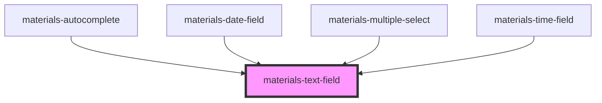

# materials-text-field

<!-- Auto Generated Below -->

## Properties

| Property           | Attribute           | Description                                          | Type                    | Default     |
| ------------------ | ------------------- | ---------------------------------------------------- | ----------------------- | ----------- |
| `customValidation` | --                  |                                                      | `() => Promise<string>` | `undefined` |
| `dense`            | `dense`             |                                                      | `boolean`               | `undefined` |
| `disabled`         | `disabled`          |                                                      | `boolean`               | `undefined` |
| `focused`          | `focused`           |                                                      | `boolean`               | `undefined` |
| `fullwidth`        | `fullwidth`         |                                                      | `boolean`               | `undefined` |
| `helperText`       | `helper-text`       |                                                      | `string`                | `undefined` |
| `hideNativeClear`  | `hide-native-clear` | Hide clear button (webkit + Edge, Moz not supported) | `boolean`               | `false`     |
| `label`            | `label`             |                                                      | `string`                | `undefined` |
| `leadingIcon`      | `leading-icon`      |                                                      | `string`                | `undefined` |
| `name`             | `name`              |                                                      | `string`                | `undefined` |
| `outlined`         | `outlined`          |                                                      | `boolean`               | `undefined` |
| `overflow`         | `overflow`          |                                                      | `boolean`               | `undefined` |
| `pattern`          | `pattern`           |                                                      | `string`                | `undefined` |
| `persistent`       | `persistent`        |                                                      | `boolean`               | `undefined` |
| `required`         | `required`          |                                                      | `boolean`               | `undefined` |
| `trailingIcon`     | `trailing-icon`     |                                                      | `string`                | `undefined` |
| `type`             | `type`              |                                                      | `string`                | `'text'`    |
| `value`            | `value`             |                                                      | `any`                   | `undefined` |
| `width`            | `width`             |                                                      | `number`                | `undefined` |

## Events

| Event    | Description | Type               |
| -------- | ----------- | ------------------ |
| `change` |             | `CustomEvent<any>` |
| `input`  |             | `CustomEvent<any>` |

## Methods

### `forceValidation() => Promise<void>`

#### Returns

Type: `Promise<void>`

### `isValid() => Promise<boolean>`

#### Returns

Type: `Promise<boolean>`

## Dependencies

### Used by

 - [materials-autocomplete](../autocomplete)
 - [materials-date-field](../date-field)
 - [materials-multiple-select](../multiple-select)
 - [materials-time-field](../time-field)

### Graph

----------------------------------------------

*Built with [StencilJS](https://stenciljs.com/)*
