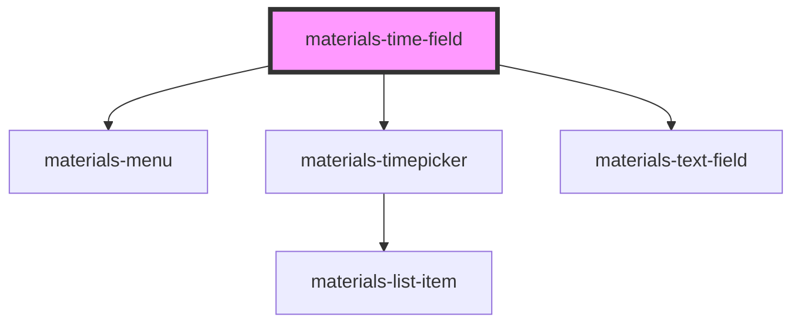

# materials-time-field

<!-- Auto Generated Below -->

## Properties

| Property           | Attribute           | Description                                                                                                                                      | Type                    | Default     |
| ------------------ | ------------------- | ------------------------------------------------------------------------------------------------------------------------------------------------ | ----------------------- | ----------- |
| `customValidation` | --                  | Provide a custom validation function to this time-field. In case of error, the promise should return a message with the error message to display | `() => Promise<string>` | `undefined` |
| `dense`            | `dense`             | Styles the date field as a dense text field.                                                                                                     | `boolean`               | `undefined` |
| `disabled`         | `disabled`          | Styles the date field as a disabled text field.                                                                                                  | `boolean`               | `undefined` |
| `focused`          | `focused`           | Styles the date field as a text field in focus.                                                                                                  | `boolean`               | `undefined` |
| `fullwidth`        | `fullwidth`         | Styles the date field as a full width text field. Warning : do not use with outlined                                                             | `boolean`               | `undefined` |
| `helperText`       | `helper-text`       | Add an helper text to this date field                                                                                                            | `string`                | `undefined` |
| `label`            | `label`             | The date field label.                                                                                                                            | `string`                | `undefined` |
| `leadingIcon`      | `leading-icon`      | Add a leading icon to ths date field. You have to pass a material icon name                                                                      | `string`                | `undefined` |
| `outlined`         | `outlined`          | Render an outlined date field                                                                                                                    | `boolean`               | `undefined` |
| `persistent`       | `persistent`        | Set the helper text persistant (appears on focus otherwise)                                                                                      | `boolean`               | `undefined` |
| `required`         | `required`          | Mark this date field as required                                                                                                                 | `boolean`               | `undefined` |
| `timepicker`       | `timepicker`        | Display a timepicker when clicking on the time-field                                                                                             | `boolean`               | `true`      |
| `timepickerFormat` | `timepicker-format` | The timepicker format                                                                                                                            | `"12h" \| "24h"`        | `'24h'`     |
| `timepickerStep`   | `timepicker-step`   | The timepicker options interval (in minutes)                                                                                                     | `number`                | `15`        |
| `value`            | `value`             | The date field value                                                                                                                             | `any`                   | `undefined` |
| `width`            | `width`             | The date field width                                                                                                                             | `number`                | `undefined` |

## Events

| Event   | Description                        | Type               |
| ------- | ---------------------------------- | ------------------ |
| `input` | Emitted when the input text change | `CustomEvent<any>` |

## Methods

### `forceValidation() => Promise<void>`

Force the validation of thid time field (native validation + custom validation)

#### Returns

Type: `Promise<void>`

### `isValid() => Promise<boolean>`

Return the time-field current value validity

#### Returns

Type: `Promise<boolean>`

## Dependencies

### Depends on

- [materials-menu](../menu)
- [materials-timepicker](../timepicker)
- [materials-text-field](../text-field)

### Graph

----------------------------------------------

*Built with [StencilJS](https://stenciljs.com/)*
