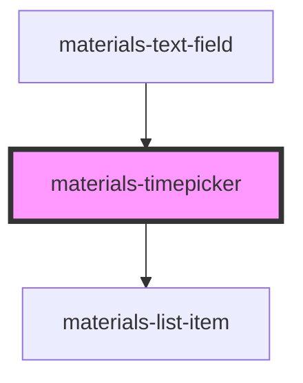

# materials-timepicker

<!-- Auto Generated Below -->

## Properties

| Property       | Attribute       | Description | Type      | Default     |
| -------------- | --------------- | ----------- | --------- | ----------- |
| `clock24`      | `clock-2-4`     |             | `boolean` | `true`      |
| `step`         | `step`          |             | `number`  | `15`        |
| `timeSelected` | `time-selected` |             | `string`  | `undefined` |

## Events

| Event                | Description | Type                  |
| -------------------- | ----------- | --------------------- |
| `timeSelectedChange` |             | `CustomEvent<string>` |

## Dependencies

### Used by

 - [materials-text-field](..\text-field)

### Depends on

- [materials-list-item](..\list-item)

### Graph

----------------------------------------------

*Built with [StencilJS](https://stenciljs.com/)*
